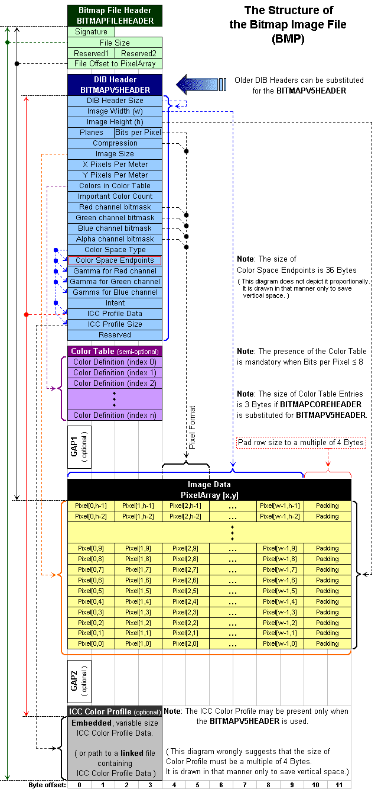

# BMP research

## Quick info
Filename extension: .bmp, .dib

Internet media type: image/bmp, image/x-bmp

## Foramt Description
The BMP file format, also known as bitmap image file, device independent bitmap (DIB) file format and bitmap, is a raster graphics image file format used to store bitmap digital images, independently of the display device (such as a graphics adapter), especially on Microsoft Windows and OS/2 operating systems.

The BMP file format is capable of storing two-dimensional digital images both monochrome and color, in various color depths, and optionally with data compression, alpha channels, and color profiles. The Windows Metafile (WMF) specification covers the BMP file format

## File format 

source: https://en.wikipedia.org/wiki/File:BMPfileFormat.png

### Bitmap File Header
Offset hex|Offset dec|Size | Purpose
----------|----------|---- |--------
00|0|2 bytes	|	The header field used to identify the BMP and DIB file is 0x42 0x4D in hexadecimal, same as BM in ASCII
02 | 2  | 4 bytes | The size of the BMP file in bytes
06 | 6  | 2 bytes | Reserved; actual value depends on the application that creates the image, if created manually can be 0
08 | 8  | 2 bytes | Reserved; actual value depends on the application that creates the image, if created manually can be 0
0A | 10 | 4 bytes | The offset, i.e. starting address, of the byte where the bitmap image data (pixel array) can be found

Posable values for magic number:
* BM
  - Windows 3.1x, 95, NT, ... etc.
* BA
  - OS/2 struct bitmap array
* CI
  - OS/2 struct color icon
* CP
  - OS/2 const color pointer
* IC
  - OS/2 struct icon
* PT
  - OS/2 pointer

### DIB Header

### Color table

### Image Data

## Checks
[Checks to perform](bmp_checks.md)

## CVEs
CVE-2019-5100

## Refrences
https://en.wikipedia.org/wiki/BMP_file_format